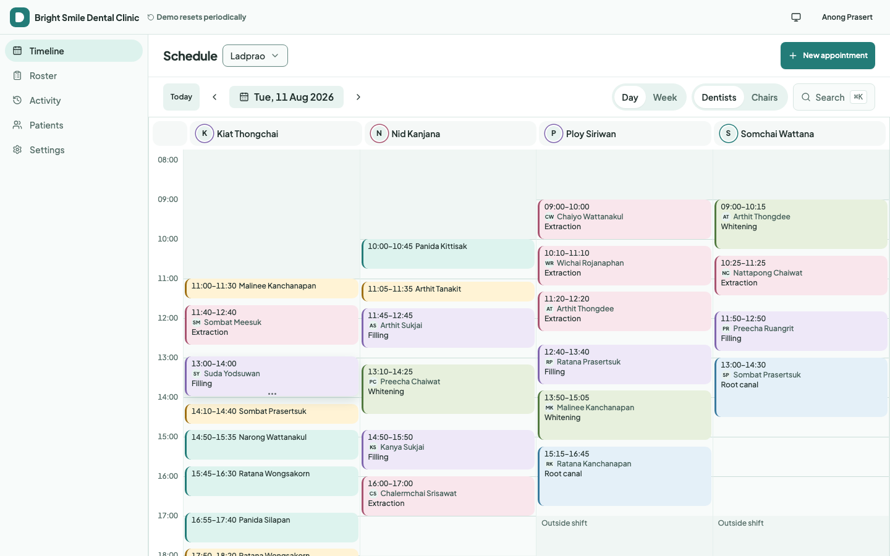
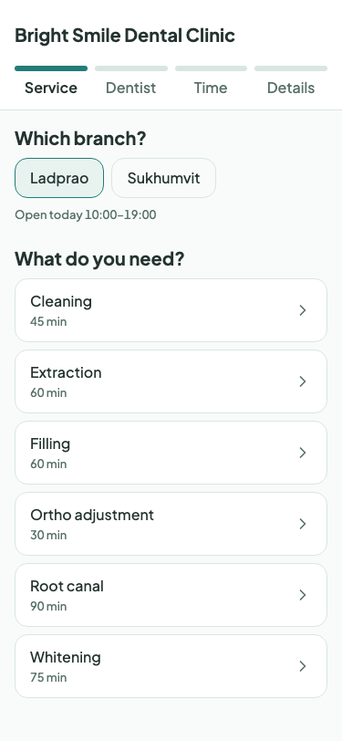
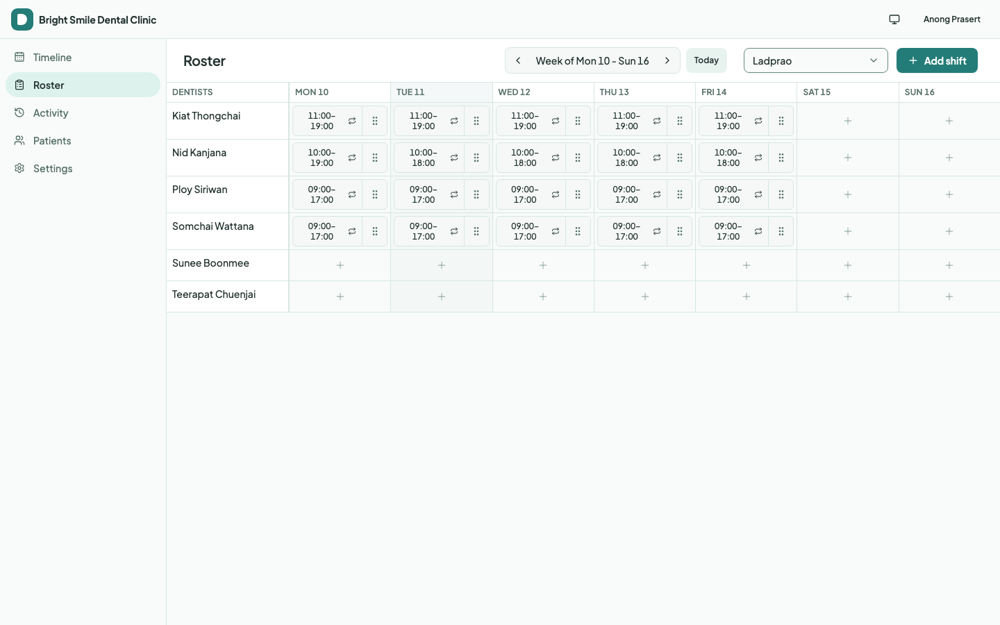
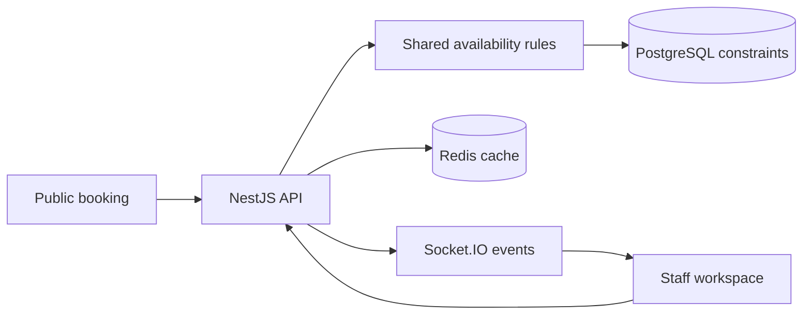

# DentalOps

[](https://github.com/nkieu-config/dentalops/actions/workflows/ci.yml)
[](https://trydentalops.vercel.app)


**A multi-tenant dental scheduling system, built solo.** It prevents a dentist, chair, or required procedure resource from being double-booked by making conflicting bookings impossible in PostgreSQL.

**Live demo:** https://trydentalops.vercel.app · **API health:** https://dentalops-api.onrender.com/api/v1/health

## Product tour

DentalOps keeps the front desk schedule and patient booking flow in one calm command center. These screenshots come from the current UI build; all demo names and appointments are synthetic.

<p align="center">
  
</p>

<p align="center"><em>Timeline — scan the day, move appointments, and see resource coverage at a glance.</em></p>

<table>
  <tr>
    <td width="50%" valign="top"></td>
    <td width="50%" valign="top"></td>
  </tr>
  <tr>
    <td align="center"><em>Public booking — a focused, touch-friendly patient path.</em></td>
    <td align="center"><em>Roster — plan dentist coverage with compact, repeatable shift controls.</em></td>
  </tr>
</table>



## Try it in 60 seconds

1. Open the [live demo](https://trydentalops.vercel.app) and select **Try as Owner** — no signup.
2. Drag an appointment onto a taken slot and watch the optimistic update roll back.
3. On a phone, open [public booking](https://trydentalops.vercel.app/book/demo-clinic), book a slot, then watch it reach the desktop timeline without a reload.

> [!NOTE]
> The demo uses free-tier hosting. Its first API request after inactivity can take about a minute, and the seeded clinic resets every six hours.

## The problem and the design

A dental appointment claims more than time: it needs a dentist, a chair, and sometimes equipment, while patients can book online at the same time staff are rescheduling at the desk. I built DentalOps to make a conflicting appointment impossible to persist, rather than merely unlikely.

1. A shared TypeScript availability engine gives the browser instant feedback from opening hours, shifts, appointments, blocks, and holds.
2. The NestJS API recomputes availability authoritatively and claims all required resources in one transaction.
3. PostgreSQL range exclusion constraints reject any remaining race; the successful booking then reaches staff through Socket.IO.

## Three decisions I'd defend in an interview

- **The database is the final authority.** GiST exclusion constraints over `tstzrange` make conflicting claims unrepresentable. [Database design](docs/database.md).
- **One availability engine runs in browser and server.** Instant feedback and server authority share the same scheduling rules. [Availability design](docs/availability.md).
- **Tenant isolation is enforced, not remembered.** An `AsyncLocalStorage` context and Prisma extension inject tenant filters; an unclassified route fails the isolation test. [Security model](docs/security.md).

## Evidence

| Guarantee | Proof |
| --- | --- |
| Conflicting bookings cannot persist | [20 concurrent requests](apps/api/test/booking-race.spec.ts) produce one row and nineteen 409 responses. |
| Tenant routes cannot leak data | [Route discovery](apps/api/test/tenant-isolation.spec.ts) fails the build when a route is absent from the isolation registry. |
| A public booking reaches staff in realtime | [Two browser contexts](apps/web/e2e/public-booking.spec.ts) verify the timeline updates without reload. |
| Redis failure cannot break integrity | [Dead Redis](apps/api/test/booking-without-redis.spec.ts) still permits an end-to-end booking while conflicting patients cannot both win. |
| The production image survives contention | [60 patients, one slot](apps/api/scripts/load/booking-contention.js) produces exactly one booking in CI against Postgres, Redis, and MongoDB. |

The complete [testing evidence matrix](docs/testing.md) covers every headline guarantee, quality gate, and CI boundary.

## Measured, then optimised

I predicted that caching availability would improve p50/p95 latency by 2.5–3× because database round trips dominated. The measured result was **2.6×**: p50 **3.84 ms → 1.47 ms** and p95 **4.99 ms → 1.94 ms**. [Method, caveats, and reproduction](docs/benchmarks/availability.md).

## Stack

| Layer | Stack | Why it matters |
| --- | --- | --- |
| **Frontend** | React 19, Vite, TanStack Query, Tailwind CSS | Public booking and staff scheduling stay responsive; Socket.IO updates the timeline without a reload. |
| **Backend** | NestJS 11, Prisma, Socket.IO, BullMQ | Clear domain boundaries, an authoritative booking flow, realtime events, and asynchronous work. |
| **Scheduling data** | PostgreSQL 16, GiST exclusion constraints | The source of truth: conflicting claims for time and resources cannot persist. |
| **Supporting data** | Redis 7, MongoDB 7 | Redis supports holds, cache, queues, and idempotency; MongoDB stores append-only audit events. |
| **Quality & delivery** | Vitest, Jest, Playwright, Docker, GitHub Actions | Evidence runs from shared scheduling rules to browser journeys and production-image contention. |

## Quick start

Requires Node 22, pnpm 10, and Docker.

```bash
pnpm setup
pnpm demo:seed
pnpm dev
```

The web app starts at http://localhost:5173, health is at http://localhost:3001/api/v1/health, and local Swagger is at http://localhost:3001/api/docs. Daily infrastructure commands, reset safety, and local email inspection are in [development notes](docs/development.md).

## Further reading

- [Architecture](docs/architecture.md) — system boundaries, data ownership, resilience, and deployment.
- [Testing](docs/testing.md) — full evidence matrix, browser journeys, and CI gates.
- [Booking](docs/booking.md) — locking, holds, idempotency, and recovery.
- [Security](docs/security.md) — authentication, token boundaries, protected fields, and tenant isolation.
- [Rostering](docs/rostering.md) — shift validation rules, series edits, and the nightly horizon job.
- [Benchmarks](docs/benchmarks/availability.md) — availability and load-test method, results, and caveats.

## Limitations

- The product is intentionally single-timezone and currently operates in Asia/Bangkok; its fixed-offset implementation is unsuitable for daylight-saving regions.
- Payments, insurance claims, and clinical records are outside this scheduling-focused scope.
- Free-tier cold starts can delay the first request; audit logging degrades visibly when MongoDB is unavailable, while booking correctness remains intact.

## About

Built solo by [Natthachak (@nkieu-config)](https://github.com/nkieu-config): product design, schema, backend, frontend, automated tests, CI, and deployment. I learned to put correctness-critical rules in database constraints and build enforcement rather than developer memory.

📫 natthachak.config@gmail.com · [LinkedIn](https://www.linkedin.com/in/natthachak)
