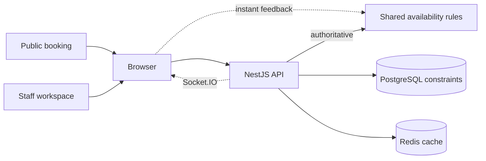

# DentalOps

[](https://github.com/nkieu-config/dentalops/actions/workflows/ci.yml)


**A multi-tenant dental scheduling system, built solo.** Patients book online while staff book at the desk, so the same dentist, chair, or equipment can be claimed twice for one slot. PostgreSQL exclusion constraints make that overlap impossible to store, not just unlikely.

**Live demo:** https://trydentalops.vercel.app

## Screenshots

<p align="center">
  
</p>

<p align="center"><em>Timeline — one branch, one day, four dentists.</em></p>

<p align="center">
  
</p>

<p align="center"><em>A drag onto a taken slot: the database refuses it, the move rolls back, and the toast names the conflict.</em></p>

<p align="center">
  
</p>

<p align="center"><em>Roster — the review queue separates coverage that blocks a booking from coverage that is only worth checking.</em></p>

<table>
  <tr>
    <td width="78%" valign="middle"></td>
    <td width="22%" valign="middle"></td>
  </tr>
  <tr>
    <td align="center"><em>The same day, by chair — dark theme.</em></td>
    <td align="center"><em>Public booking, on a phone.</em></td>
  </tr>
</table>

## Try it in 60 seconds

1. Open the [live demo](https://trydentalops.vercel.app) and select **Try as Owner** — no signup.
2. Drag an appointment onto a taken slot and watch the optimistic update roll back.
3. On a phone, open [public booking](https://trydentalops.vercel.app/book/demo-clinic), book a slot, then watch it reach the desktop timeline without a reload.

> [!NOTE]
> Free-tier hosting: the first API request after inactivity can take about a minute, and the demo clinic resets every six hours.

## How it works



- **The database is the final authority.** One transaction claims every resource an appointment needs, and application code can't forget a rule that lives in a GiST constraint. [Database design](docs/database.md).
- **One availability engine runs in browser and server.** Instant feedback and server authority share the same scheduling rules. [Scheduling engine](docs/scheduling-engine.md).
- **Tenant isolation is enforced, not remembered.** An `AsyncLocalStorage` context and Prisma extension inject tenant filters; an unclassified route fails the isolation test. [Security model](docs/security.md).
- **The audit log can't take a booking down with it.** It lives in its own store rather than a table beside the bookings it records, and its writes are fire-and-forget. [Architecture](docs/architecture.md).

## Evidence

| Guarantee | Proof |
| --- | --- |
| Conflicting bookings cannot persist | [20 concurrent requests](apps/api/test/booking-race.spec.ts) produce one booking and nineteen 409s; four dentists racing for three chairs leave three winners on distinct chairs. [60 patients, one slot](apps/api/scripts/load/booking-contention.js) produce exactly one booking against the production image in CI. |
| Tenant routes cannot leak data | [Route discovery](apps/api/test/tenant-isolation.spec.ts) fails the build when a route is missing from the isolation registry, and a cross-tenant id returns 404 rather than the 403 that would confirm the row exists. |
| A public booking reaches staff in realtime | [Two browser contexts](apps/web/e2e/public-booking.spec.ts) confirm the timeline updates without reload. |
| Correctness survives a dead Redis | [With Redis unreachable](apps/api/test/booking-without-redis.spec.ts) a hold stops being a lock and becomes a signed token, so two patients can hold one slot, and PostgreSQL still lets exactly one of them book it. |
| A cache hit answers 2.6× faster | Predicted 2.5–3×, measured **2.6×** — p50 3.84 ms → 1.47 ms, p95 4.99 ms → 1.94 ms on all-hit traffic. [Method and caveats](docs/benchmarks/latency.md). |

The complete [testing evidence matrix](docs/testing.md) covers every headline guarantee, quality gate, and CI boundary.

## Tech stack

| Layer | Stack |
| --- | --- |
| **Frontend** | React 19, Vite, TanStack Query, Tailwind CSS |
| **Backend** | NestJS 11, Prisma, Socket.IO, BullMQ |
| **Scheduling data** | PostgreSQL 16 with GiST exclusion constraints |
| **Coordination** | Redis 7 — slot holds, availability cache, queues, idempotency keys |
| **Audit trail** | MongoDB 7 — append-only events behind a TTL index |
| **Quality & delivery** | Vitest, Jest, Playwright, Docker, GitHub Actions |

## Run it locally

Requires Node 22, pnpm 10, and Docker.

```bash
pnpm setup
pnpm demo:seed
pnpm dev
```

The web app starts at http://localhost:5173, health is at http://localhost:3001/api/v1/health (the deployed API answers the same route at [dentalops-api.onrender.com](https://dentalops-api.onrender.com/api/v1/health)), and local Swagger is at http://localhost:3001/api/docs. Daily infrastructure commands, reset safety, and local email inspection are in [setup notes](docs/setup.md).

## Documentation

- [Architecture](docs/architecture.md) — boundaries, data ownership, and the one rule that decides which layer may say a booking exists.
- [Booking](docs/booking.md) — transactions, lock ordering, and why a receptionist may take a slot a patient is still holding.
- [Security](docs/security.md) — tokens, tenant isolation, and a privilege escalation this project found in its own code and fixed.
- [Latency](docs/benchmarks/latency.md) — the prediction recorded before the cache was built, the method, and the caveats.
- [Load tests](docs/benchmarks/load.md) — sixty patients racing for one slot, and a cache benchmark that missed every request until it was rewritten.

## Limitations

- Single-timezone by design (Asia/Bangkok); the fixed-offset implementation is unsuitable for daylight-saving regions.
- Payments, insurance claims, and clinical records are out of scope.
- When MongoDB is unavailable the activity log stops recording and says so; bookings are unaffected.
- The hosted demo logs confirmation emails rather than sending them; the manage link is reachable from the booking confirmation screen.

## License

MIT — see [LICENSE](LICENSE).
