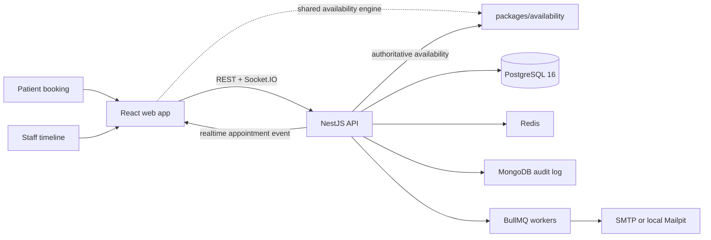

# Architecture

DentalOps is a pnpm/Turborepo monorepo with a React staff and public-booking app, a NestJS API, and shared TypeScript packages. The architecture is organised around one rule: a booking may be fast to inspect in the browser, but only the server and database may decide whether it exists.

## System topology

## Boundaries and ownership

| Boundary | Responsibility | Source of truth |
| --- | --- | --- |
| React web app | Staff scheduling, public booking, optimistic interaction, and realtime display | The API response; local availability feedback is advisory |
| Shared availability package | Intersects opening hours, shifts, appointments, blocks, and holds | Pure TypeScript rules used by browser and API |
| NestJS API | Authentication, tenant context, authoritative validation, transactions, and realtime events | Request-scoped service layer |
| PostgreSQL | Appointments, shifts, resource claims, and exclusion constraints | Durable scheduling truth |
| Redis | Holds, availability cache, idempotency records, queues, and rate-limit coordination | Disposable acceleration and coordination |
| MongoDB | Append-only audit events with flexible action shape | Audit trail, not booking authority |

## Booking correctness

The browser runs the availability engine so it can guide a user immediately. The API runs the same engine again, then writes the appointment and all resource claims in one transaction. PostgreSQL enforces non-overlap with generated `tstzrange` columns and GiST exclusion constraints, so a direct query, a future code path, or two racing requests cannot create a conflicting booking.

Resource capacity is represented as physical units. A procedure requiring a chair and X-ray unit claims one row for each resource; capacity emerges from allocating an available unit rather than from a counter that can drift. [Database design](database.md) explains the constraints and resource model. [Booking design](booking.md) explains lock ordering, holds, and idempotency.

## Tenant isolation and security

Each authenticated request receives an `AsyncLocalStorage` context containing tenant, user, and role. A Prisma extension injects the tenant filter into operations on tenant-owned models and throws when a scoped query has no context. The tenant-isolation test discovers registered routes and requires every one to declare its isolation behavior.

Staff access uses a short-lived Bearer token and an httpOnly refresh cookie. Manage links and signed fallback holds are separate token purposes; they cannot be replayed as staff credentials. [Security model](security.md) contains the complete control flow and error contract.

## Failure behavior

Redis improves the experience but does not decide integrity. A hold becomes a signed fallback when Redis is unavailable; cache, idempotency, and distributed rate-limit coordination degrade while the PostgreSQL transaction remains authoritative. Email is enqueued after commit, so an enqueue failure cannot roll back a booking.

MongoDB is an audit dependency, not a booking dependency. If it cannot connect, the API starts with audit logging disabled and reports that state through health. The public demo uses free-tier hosting, so cold starts are an explicit operating trade-off.

## Delivery boundary

The API ships as a Docker multi-stage image. CI builds that image, starts it beside real Postgres, Redis, and MongoDB, verifies health, then runs booking contention. Vercel serves the web app; Render runs the API image; Neon, Upstash, MongoDB Atlas, and Sentry provide managed dependencies. [Testing and CI details](testing.md) document the gates and their limitations.
