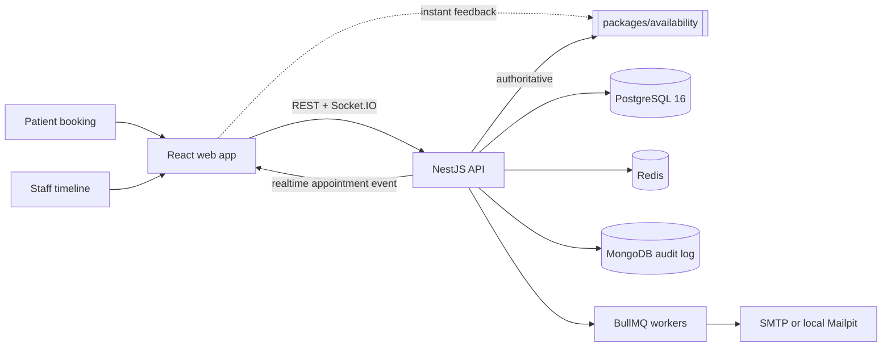

# Architecture

DentalOps is a pnpm/Turborepo monorepo: a React staff and public-booking app, a NestJS API, and
shared TypeScript packages. One rule organizes it: a booking may be fast to inspect in the
browser, but only the server and database may decide whether it exists.

## System topology

## Boundaries and ownership

| Boundary | Responsibility | Source of truth |
| --- | --- | --- |
| React web app | Staff scheduling, public booking, optimistic interaction, realtime display | The API response; local feedback is advisory |
| Shared availability package | Intersects opening hours, shifts, appointments, blocks, holds | Pure TypeScript, used by browser and API |
| NestJS API | Auth, tenant context, authoritative validation, transactions, realtime events | Request-scoped service layer |
| PostgreSQL | Appointments, shifts, resource claims, exclusion constraints | Durable scheduling truth |
| Redis | Holds, availability cache, idempotency, queues, rate-limit coordination | Disposable acceleration and coordination |
| MongoDB | Append-only audit events | Audit trail, not booking authority |

## Booking correctness

The browser runs the availability engine for instant feedback. The API runs the same engine
again, then writes the appointment and all resource claims in one transaction. PostgreSQL
enforces non-overlap with generated `tstzrange` columns and GiST exclusion constraints, so no
code path — direct query, future change, or two racing requests — can create a conflicting
booking. [Database](database.md) · [Booking](booking.md) · [Scheduling engine](scheduling-engine.md) · [Rostering](rostering.md).

## Tenant isolation and security

Every authenticated request gets an `AsyncLocalStorage` context carrying tenant, user, and role.
A Prisma extension injects the tenant filter into every operation on a tenant-owned model and
throws when a scoped query has no context. A test discovers every registered route and requires
each to declare its isolation behavior. [Security](security.md).

## Failure behavior

Redis improves the experience but does not decide integrity: a hold becomes a signed fallback
when Redis is unavailable, while the PostgreSQL transaction stays authoritative. Email is
enqueued after commit, so an enqueue failure cannot roll back a booking. MongoDB is an audit
dependency, not a booking dependency — if it cannot connect, the API starts with audit logging
disabled and reports that through health.

## Delivery

The API ships as a Docker multi-stage image. CI builds it, starts it beside real Postgres, Redis,
and MongoDB, verifies health, then runs booking contention. Vercel serves the web app; Render
runs the API image; Neon, Upstash, MongoDB Atlas, and Sentry are the managed dependencies.
[Testing and CI](testing.md).
